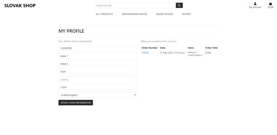
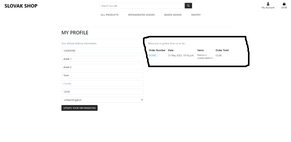
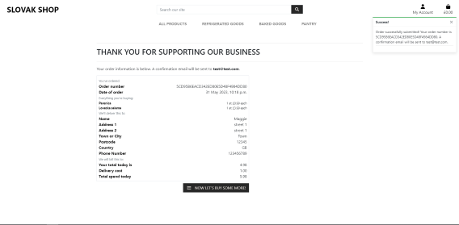
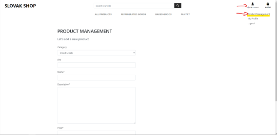
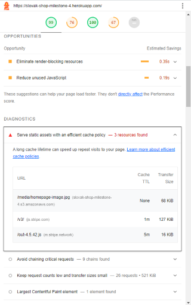

# Testing for Milestone 4 project - Slovak shop 

1. [Continuous testing](#continuous-testing)
2. [User story testing](#user-testing)
    1. [Returning user](#returning-user)
    2. [New user](#new-user)
    3. [Administrator](#administrator)
3. [Bugs](#bugs)
4. [Lighthouse](#lighthouse)
5. [Additional testing](#additional-testing)

## Continuous testing

The code was tested at every commit and implementation using user stories as a guidance. Utmost care was given to every detail that could be amended and fixed.

A Python linter was also used to identify issues with the code as they arose and the debug setting allowed me to inspect any issues in the moment.

Due to the extent of the number of files with potential code to test, I have opted to forego manual validators such as those used for HTML, CSS and Python and trusted in the Linter instead, as it pulls from the latest guidance. The only problem I didn't fix in the linter is that of lines of code being too long - as I deemed that unnecessary.

## User testing

### Returning user

#### Retain my details for future checkout

#### Have an order history

#### Ability to update my details

### New user

#### Find items easily

#### Add items to a cart

#### Pay seamlessly

#### Receive news of new products
This was unfortunately not achieved in the time that I was doing this project. It is absolutely something I would love to add for future developments.

### Administrator

#### Add products

#### Edit products

#### Delete products

## Bugs

Overall, I really struggled with the clash of bootstrap, django and custom styling. It would seemingly choose which to pick at random and I was forced to use a lot of !important which I would absolutely try to avoid in a professional setting where possible.

### Significant usage of walkthrough code

With my best efforts, I was not able to not apply Size in the product model, despite not needing to use it, so I had to copy over code from the tutorial for bag.html, quantity_input_script.html and views.py on 28th May 2023, 15:28 as the omission of this variable caused many issues. [Commit log](https://github.com/mutkovicova/milestone-4-project/commit/eb505f3e9d87589e0668ea1bfbc325491253f0a0)

I attempted to resolve this over a 4 hour span but due to time constraints, had to abandon the problem.

### Use of noimage.png

While the code accepts the noimage default in the products page fine, it does not like it in product detail. I suspect it's just a small piece of code but have run out of time.

### Stripe payments integration

Following the walkthrough, I do believe Stripe updated the documentation and in the future, I will make sure to familiarise myself with their recommended route. For the purposes of this project, I have decided to follow the walkthrough code.

### Deleting an item from database while in basket

A seemingly known bug occurs if a user tries to delete a product from the shop while that product is in the checkout bag. It will trigger a full Django meltdown that says 'No Product found' and refuse to load anything else. 
Should this happen, Go to DevTools -> Applications -> Cookies -> Session.id and delete the session. This will reset the interface and allow you to continue working.

## Lighthouse

Lighthouse testing revealed issues only with Accessibility. This was strange, because I fully expected the image header to have poor contrast, however this was not the case and the menu colour contrast was deemed the biggest issue.

While I could change this quite easily, I have opted not to.

Further issues flagged were with image caching, namely the homepage-image file (which was deemed too large) and two files that are a part of the Stripe integration, and therefore I have no control over.

Overall, I am really satisfied with this.

## Additional testing

I have asked friends to test the app and try to act like a shopper. They had no issues, although it was a short time before submission due to Heroku platform issues.
